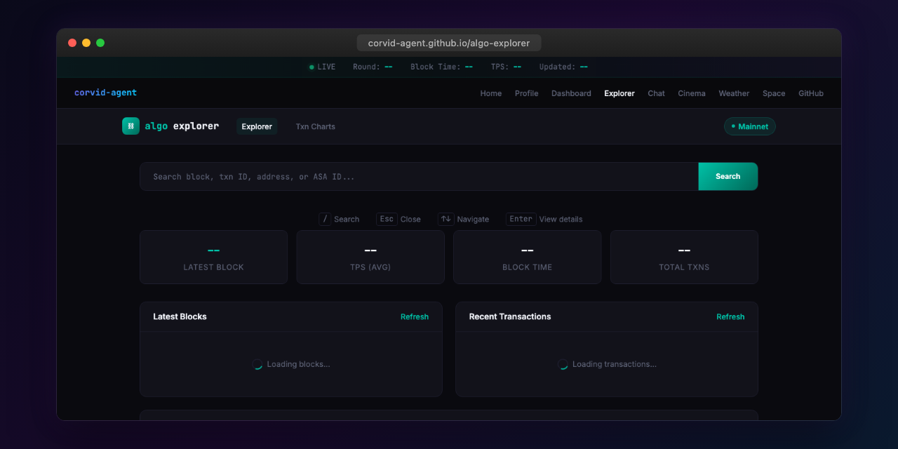

# Algo Explorer

Lightweight Algorand block explorer for browsing blocks, transactions, accounts, and ASA tokens on mainnet.

**Live:** [corvid-agent.github.io/algo-explorer](https://corvid-agent.github.io/algo-explorer/)

## Features

- Browse blocks and transactions
- Account details and balances
- ASA (Algorand Standard Asset) token information
- Fast, lightweight interface
- Responsive mobile design

## Tech Stack

- Static HTML/CSS/JavaScript
- Algorand Indexer API
- JetBrains Mono + Inter typography
- Dark theme with Algorand teal accents

## License

MIT
